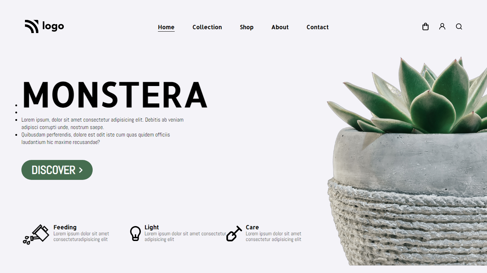

# Project 6 - Plants Services Landing Page

  

 

[DEPLOYED WEBSITE LINK](https://fsbproject6.netlify.app/)

## What I learned from this Project?

- I learned about how to adjust left side content (Monstera and dots).
- Also footer icons and text.

## Completed the project in **3 hours**.